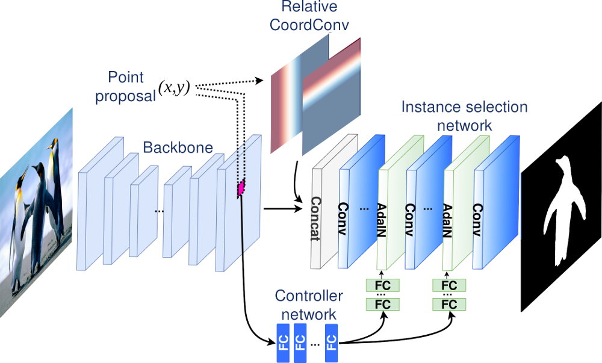
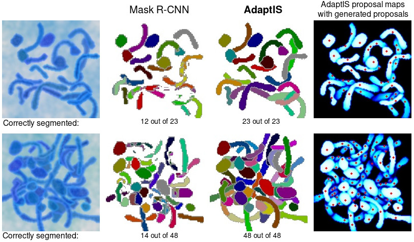
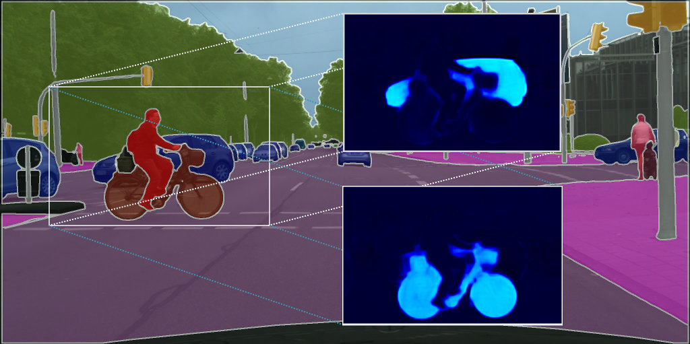

## AdaptIS: Adaptive Instance Selection Network
This codebase implements the system described in the paper ["AdaptIS: Adaptive Instance Selection Network"](https://arxiv.org/abs/1909.07829), Konstantin Sofiiuk, Olga Barinova, Anton Konushin. Accepted at ICCV 2019.
The code performs **instance segmentation** and can be also used for **panoptic segmentation**.

**[UPDATE]** We have released PyTorch implementation of our algorithm (now it supports only ToyV1 and ToyV2 datasets on single gpu). See [pytorch](https://github.com/saic-vul/adaptis/tree/pytorch) branch. 

<p align="center">
  
</p>


### ToyV2 dataset


We generated an even more complex synthetic dataset to show the main advantage of our algorithm over other detection-based instance segmentation algorithms. The new dataset contains 25000 images for training and 1000 images each for validation and testing. Each image has resolution of 128x128 and can contain from 12 to 52 highly overlapping objects.

You can download the ToyV2 dataset from [here](https://drive.google.com/open?id=1iUMuWZUA4wzBC3ka01jkUM5hNqU3rV_U). You can test and visualize the model trained on this dataset using [this](notebooks/test_toy_v2_model.ipynb) notebook. You can download pretrained model from [here](https://drive.google.com/open?id=1RxepfpJF5gRpRNYu1urdV748suF3TL5k).




### ToyV1 dataset

We used the ToyV1 dataset for our experiments in the paper. We generated 12k samples for the toy dataset (10k for training and 2k for testing). The dataset has two versions:
* **original** contains generated samples without augmentations;
* **augmented** contains generated samples with fixed augmentations (random noise and blur).

We trained our model on the original/train part and tested it on the augmented/test part. You can download the toy dataset from [here](https://drive.google.com/open?id=161UZrYSE_B3W3hIvs1FaXFvoFaZae4FT). The repository provides an example of testing and metric evalutation for the toy dataset. You can test and visualize trained model on the toy dataset using [provided](notebooks/test_toy_model.ipynb) Jupyter Notebook. You can download pretrained model from [here](https://drive.google.com/open?id=1IuJUh0JvbKYILBxCeO2h6U4LG-9DoTHi).


### Setting up a development environment

AdaptIS is built using Python 3.6 and relies on the recent version of MXNet. The easiest way to install MXNet
is through pip. The following command installs all necessary packages:

```
pip3 install -r requirements.txt
```

Some of the inference code is written using Cython, you must compile the code before testing:
```
make -C ./adaptis/inference/cython_utils
```


### Training

You can train model for the ToyV2 dataset by the following command:
```
python3 train_toy_v2.py --batch-size=14 --workers=2 --gpus=0 --dataset-path=<toy-dataset-path>
```

You can train model for the toy dataset (original from the paper) by the following command:
```
python3 train_toy.py --batch-size=14 --workers=2 --gpus=0 --dataset-path=<toy-dataset-path>
```

To train ResNet-50 model for Cityscapes use the script:
```
python3 train_cityscapes.py --batch-size=8 --workers=2 --gpus=0,1 --dataset-path=<cityscapes-path>
```

### Main results




COCO:

| Backbone         |  Split       |PQ     | PQ<sup>st</sup> | PQ<sup>th</sup> |
| ---------------- | ------------ | ----- | ----- | ---- |
| ResNeXt-101      |     *val*    |  42.3 | 31.8  | 49.2 |
| ResNeXt-101      |  *test-dev*  |  42.8 | 31.8  | 50.1 |

Mapillary Vistas:

| Backbone         |  Split       |PQ    | PQ<sup>st</sup> | PQ<sup>th</sup> |
| ---------------- | ----------- | ----- | ----- | ---- |
| ResNeXt-101      |    *val*    |  35.9 | 41.9  | 31.5 |
| ResNeXt-101      | *test-dev*  |  36.8 | 41.4  | 33.3 |


Cityscapes:

| Backbone         | PQ   | PQ<sup>st</sup> | PQ<sup>th</sup> | mIoU |  AP  |
| ---------------- | ---- | ----- | ----- | ---- | ---- |
| ResNet-50        | 59.0 | 61.3  | 55.8  | 75.3 | 32.3 |
| ResNet-101       | 60.6 | 62.9  | 57.5  | 77.2 | 33.9 |
| ResNeXt-101      | 62.0 | 64.4  | 58.7  | 79.2 | 36.3 |


### License
The code of AdaptIS is released under the MPL 2.0 License. MPL is a copyleft license that is easy to comply with. You must make the source code for any of your changes available under MPL, but you can combine the MPL software with proprietary code, as long as you keep the MPL code in separate files.


### Citation
If you use this code for your research, please cite our [paper](https://arxiv.org/abs/1909.07829).

```
@article{adaptis2019,
  title={AdaptIS: Adaptive Instance Selection Network},
  author={Konstantin Sofiiuk, Olga Barinova, Anton Konushin},
  journal={arXiv preprint arXiv:1909.07829},
  year={2019}
}
```
